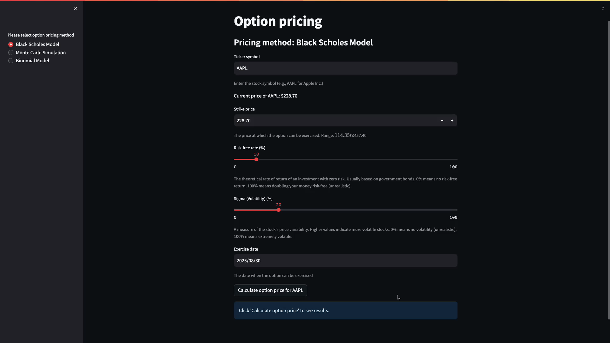
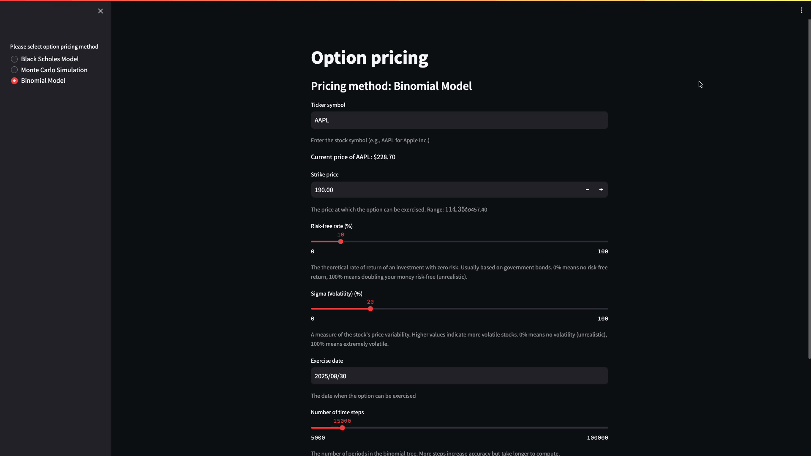

# Option Pricing Models

## Introduction
This repository contains a simple web app for calculating European option prices using three different methods:

1. Black-Scholes model
2. Monte Carlo simulation
3. Binomial model

The app is implemented in Python 3.9 and uses the Streamlit library for visualization.

## Option Pricing Methods

### 1. Black-Scholes Model
A mathematical model used to calculate the theoretical price of European-style options, based on factors like current stock price, strike price, time to expiration, risk-free rate, and volatility.

### 2. Monte Carlo Simulation
A probabilistic method that uses random sampling to estimate option prices by simulating multiple possible price paths of the underlying asset.

### 3. Binomial Model
A discrete-time model that represents the evolution of the underlying asset's price as a binomial tree, allowing for the calculation of option prices at different time steps.

## Features

- Fetches latest stock price data from Yahoo Finance API using pandas-datareader
- Caches data using requests-cache to avoid duplicate API calls
- Allows users to input various parameters:
  - Strike price
  - Risk-free rate (%)
  - Sigma (Volatility) (%)
  - Exercise date
- Calculates option prices based on user inputs
- Provides a user-friendly interface for testing different scenarios

## Project Structure

- `demo/`: Contains GIF files demonstrating the Streamlit app
- `option_pricing/`: Python package containing model implementations
- `streamlit_app.py`: Main script for the Streamlit web app
- `Requirements.txt`: List of required Python packages
- `Dockerfile`: Configuration for running the app in a Docker container

## How to Run the App

### Using Docker Locally
The easiest way to run the app is using Docker. Make sure you have Docker installed on your machine before proceeding.

1. Navigate to the repository directory in your terminal.

2. Build the Docker image:
   ```
   docker build -t options-pricing:latest .
   ```

3. Verify the image was built successfully:
   ```
   docker image ls
   ```

4. Run the Docker container:
   ```
   docker run -p 8080:8080 options-pricing:latest
   ```

5. Access the app in your web browser at:
   ```
   http://0.0.0.0:8080/
   ```

### Using Google Cloud

To deploy the Docker container to Google Cloud Platform (GCP), follow these steps:

1. Prerequisites:
   - Have a Google account
   - Create a project on Google Cloud Console
   - Set up billing for your project (be aware of GCP's pricing structure)
   - Install and set up Google Cloud SDK

2. Verify and set your GCP project:
   - Check the current project:
     ```
     gcloud config get-value project
     ```
   - Set a different project if needed:
     ```
     gcloud config set project YOUR_PROJECT_NAME
     ```

3. Deploy the application:
   - Run the following command (uses the app.yaml file in your project):
     ```
     gcloud app deploy
     ```
   - Select the nearest server location when prompted
   - Wait for the deployment process to complete

4. Access your web app:
   - After deployment, you'll receive a URL for your app
   - The URL format will be: https://YOUR_PROJECT_NAME.REGION.r.appspot.com/
   - You can also find this URL in the Google Cloud Console

Note: Ensure you understand GCP's pricing before deploying to avoid unexpected charges.

## Streamlit Web App Demonstrations

### Black-Scholes Model


### Monte Carlo Option Pricing


### Binomial Model


By following these instructions, you can easily set up and explore the option pricing models using the Streamlit web app. Feel free to experiment with different parameters and see how they affect the calculated option prices.